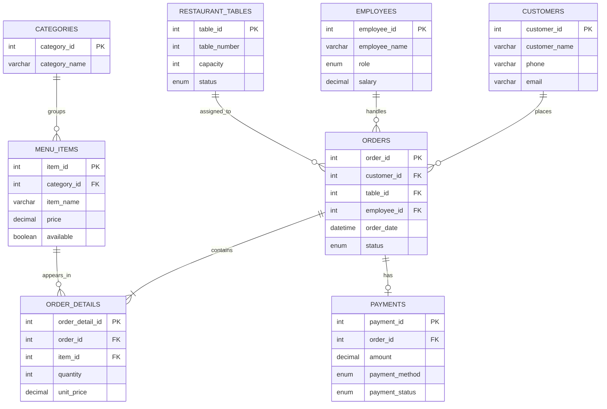

# ER Diagram

Paste the following Mermaid code into a Mermaid-compatible Markdown preview or Mermaid Live Editor to render the ER diagram.

```mermaid
erDiagram
    CUSTOMERS ||--o{ ORDERS : places
    EMPLOYEES ||--o{ ORDERS : handles
    RESTAURANT_TABLES ||--o{ ORDERS : assigned_to
    ORDERS ||--|{ ORDER_DETAILS : contains
    MENU_ITEMS ||--o{ ORDER_DETAILS : appears_in
    CATEGORIES ||--o{ MENU_ITEMS : groups
    ORDERS ||--o| PAYMENTS : has

    CUSTOMERS {
        int customer_id PK
        varchar customer_name
        varchar phone
        varchar email
    }
    EMPLOYEES {
        int employee_id PK
        varchar employee_name
        enum role
        decimal salary
    }
    RESTAURANT_TABLES {
        int table_id PK
        int table_number
        int capacity
        enum status
    }
    CATEGORIES {
        int category_id PK
        varchar category_name
    }
    MENU_ITEMS {
        int item_id PK
        int category_id FK
        varchar item_name
        decimal price
        boolean available
    }
    ORDERS {
        int order_id PK
        int customer_id FK
        int table_id FK
        int employee_id FK
        datetime order_date
        enum status
    }
    ORDER_DETAILS {
        int order_detail_id PK
        int order_id FK
        int item_id FK
        int quantity
        decimal unit_price
    }
    PAYMENTS {
        int payment_id PK
        int order_id FK
        decimal amount
        enum payment_method
        enum payment_status
    }
```
